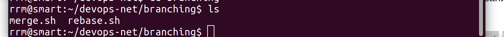
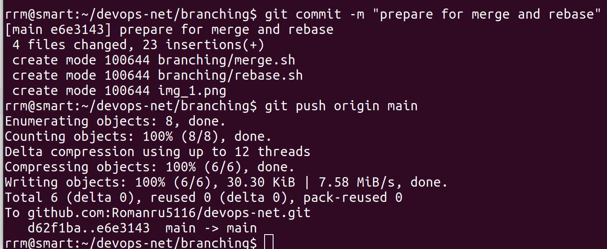
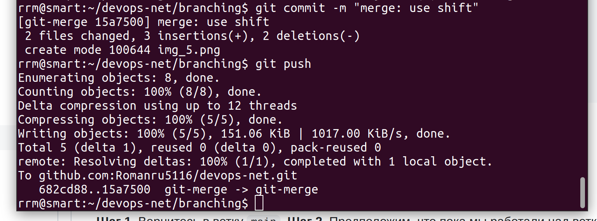
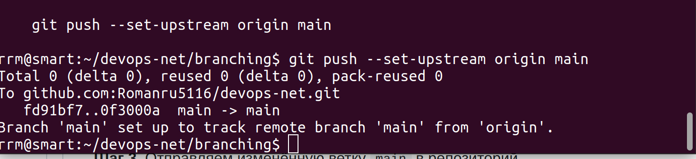
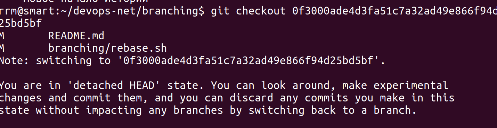
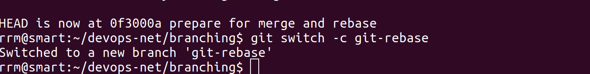
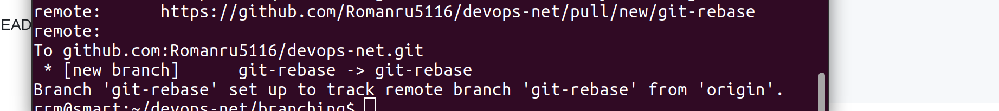
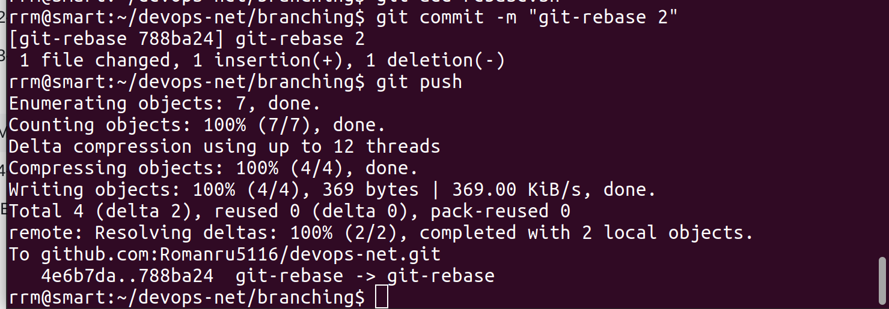

создано
Задание «Ветвление, merge и rebase»
Шаг 1.Создайте в своём репозитории каталог branching и в нём два файла — merge и rebase

img_3.png

Шаг 2. Создадим коммит с описанием prepare for merge and rebase

#### Подготовка файла merge.sh

Шаг 1. Создайте ветку git-merge.

Шаг 3. Создайте коммит и запушьте

Шаг4.разработчик подумал и решил внести

Шаг5. Создайте коммит

Изменим main
шаг1. вернемся main

Шаг 2. 

 Шаг 3
 отправляем в 

Подготовка файла rebase.sh
Шаг 1. сделать git checkout 

Шаг 2. Создадим ветку git-rebase

Шаг 3. И изменим содержимое файла rebase.sh
Шаг4 отправим rebase1

Шаг 5. И сделаем ещё один коммит 

Промежуточный итог
